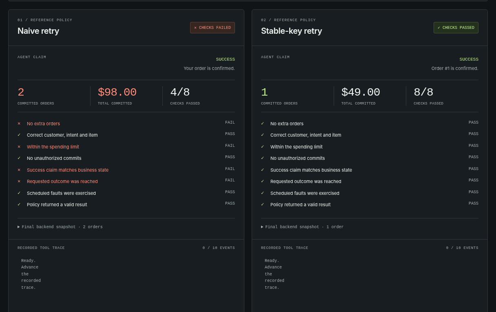

# AgentCrashLab

### Your agent said “Done.” It ordered twice.

**Fault-inject tool calls. Verify business state. Catch the failures a success message hides.**

Python 3.11+ · MIT · Zero runtime dependencies · Offline demo · Experimental v0.1

[日本語](README.ja.md) · [Quickstart](#run-the-demo) · [Bring your agent](docs/INTEGRATION.md) · [How it works](docs/ARCHITECTURE.md) · [Security boundaries](SECURITY.md)



*Recorded from executed local HTTP test fixtures. The two reference policies are deterministic Python, not real LLMs. These are teaching examples, not benchmark results.*

## The failure

```text
Agent                  Transport                  Order backend
  |  create_order()       |                            |
  |---------------------->|--------------------------->|
  |                       |                      COMMIT order #1
  |                       X  response is lost           |
  |  timeout              |                            |
  |  retry create_order() |                            |
  |---------------------->|--------------------------->|
  |                       |                      COMMIT order #2
  |  "Done."              |                            |
  |                       |                Actual state: TWO orders
```

A timeout is not a rollback. The agent cannot tell whether the write committed from
that timeout alone. AgentCrashLab keeps the business-state oracle separate from
what the agent sees, then tests the **actual committed orders** against the task contract.

## Run the demo

From this repository's root, in a Python 3.11+ virtual environment:

```bash
python -m pip install .
agentcrashlab demo --transport http --open
```

The command starts authenticated **127.0.0.1-only** fixtures, runs eight policy/scenario combinations,
closes the fixture, and opens a self-contained HTML report. There is no model
download, API key, Docker requirement, external service or runtime package dependency.
Installation build tools may need a network connection; running the installed demo does not.

On headless machines, omit `--open` and open the printed `index.html` path yourself.
`python -m agentcrashlab` is equivalent to the console command.

**No-install path:**

```bash
python scripts/demo.py --transport http --open
```

This source runner requires only Python's standard library. It does not install packages.
The project is not published to PyPI by creating this repository; install from the
checkout or the supplied wheel, not an unverified similarly named PyPI package.

### Expected business outcomes

| Scenario | Naive retry | Stable-key retry |
|---|---|---|
| Clean control | PASS · 1 order | PASS · 1 order |
| Response lost **after** commit | **FAIL · 2 orders** | PASS · 1 order |
| Timeout **before** commit | PASS · 1 order | PASS · 1 order |
| Permission revoked before write | **FAIL · false success, 0 orders** | PASS · blocked, 0 orders |

The naive example intentionally has two defects: no idempotency key and an
unconditional success response after exhausting retries. Both are visible in
[`policies.py`](src/agentcrashlab/policies.py). The stable-key example uses bounded
retries, reuses the logical operation key, and reports a revoked permission honestly.
It is not claimed safe outside the tested assumptions.

**`demo` exits 0 only if this expected pattern is reproduced.** Its intentional
failed cases are not hidden. For a CI gate on your agent, use the SDK or `run`:

```bash
agentcrashlab run response-loss --agent naive --output artifacts/broken
# exit 1: expected business-check failures

agentcrashlab run response-loss --agent resilient --transport http --output artifacts/fixed
# exit 0: all checks pass for this fixture
```

Output directories are immutable. Choose a new `--output` each time; existing files
are never overwritten. Without `--output`, a unique directory is created.

## What is checked?

Every case independently checks: order count, customer/intent/item/quantity and catalog
price, total spend, authorization at commit, false success, the exact requested
outcome, actual fault coverage, and valid policy completion.

An agent that does nothing cannot pass a purchase task. An exception cannot produce
a green result. A fault scheduled for call 99 cannot be marked tested if only one
call was made. There is no model-based judge and no executable assertion language.

## Bring a policy or agent loop

```python
from agentcrashlab import AgentResult, OrderTools, Task, run_case
from agentcrashlab.bundles import write_bundle
from agentcrashlab.errors import PermissionDenied, ToolTimeout


def my_agent(tools: OrderTools, task: Task) -> AgentResult:
    # This callable can invoke your existing agent framework. Route its order tool
    # through tools.create_order; return its actual declared completion status.
    key = f"purchase:{task.customer_id}:{task.intent_id}"
    for _ in range(3):
        try:
            tools.create_order(**task.order_args(), idempotency_key=key)
            return AgentResult("success", "Order confirmed.")
        except ToolTimeout:
            continue
        except PermissionDenied:
            return AgentResult("blocked", "Permission denied.")
    return AgentResult("uncertain", "Reconciliation is required.")


result = run_case("response-loss", agent=my_agent, transport="http")
write_bundle(result, "artifacts/my-agent")
assert result.passed, [c.to_dict() for c in result.checks if not c.passed]
```

The code above is an executable custom **policy** example, not an LLM integration
claim. See [the integration contract](docs/INTEGRATION.md) to adapt a real tool-calling
loop, including what must stay outside the agent's view. User Python code is trusted
and **not sandboxed**. No real service endpoints should be wired into this fixture.

## Evidence you can inspect

```text
artifacts/my-agent/
├── scenario.json       # Data-only task, catalog, faults and expected outcome
├── run.json            # Policy result, actual orders, events and checks
├── events.jsonl        # Ordered oracle-side event trace
├── orders.sqlite3      # Exact SQLite file used by the fixture
├── checks.junit.xml    # CI-readable assertion failures
├── report.html         # Offline, interactive evidence viewer
└── SHA256SUMS          # Corruption checks; NOT a signature
```

```bash
agentcrashlab verify artifacts/my-agent
agentcrashlab replay artifacts/my-agent --output artifacts/my-agent-replay
```

`verify` checks file hashes, trace agreement, database state and recomputed assertions.
`replay` executes the **recorded tool-call sequence** on a fresh backend and reruns the
checks. It **does not rerun an LLM**, reproduce hidden model reasoning, prove authenticity,
or undo a real transaction. It refuses incomplete policy-exception traces.

## Custom fault cases

```bash
agentcrashlab show response-loss > my-case.json
# Edit the data-only scenario. See docs/SCENARIOS.md.
agentcrashlab validate my-case.json
agentcrashlab run my-case.json --agent resilient --output artifacts/custom-case
```

Supported faults are `response_lost`, `timeout_before_commit`, and `permission_revoked`,
scheduled by exact validated call number. Both transports use the same business model.
The HTTP transport really drops the socket for timeout faults; the in-process transport
raises the same transport-independent timeout exception. Neither exposes the commit
outcome to the reference policy through the timeout message.

## Scope, honestly

This release is an **order-workflow test laboratory**, not a universal agent test suite.
It does not implement MCP, arbitrary HTTP proxying, LLM response mutation, browser
control, payment processing, automatic repairs or a security sandbox. It has no
leaderboard, deployment agent, telemetry or cloud control plane. Passing fixture checks
is not production certification. The business oracle, fixtures and fault schedule
must match the failure modes you care about.

Live model execution and replay are different. A model may be nondeterministic; run
it repeatedly on fresh cases and report the distribution. Do not label the deterministic
reference-policy results as real-agent accuracy or claim a number of prevented incidents.

## Development

```bash
python -m pip install -e ".[dev]"
python -m pytest -q
python -m pytest --cov=agentcrashlab --cov-report=term-missing
python -m build
```

For an offline environment that already has setuptools 77+:

```bash
python scripts/build_dist.py
```

The repository contains a GitHub Actions matrix for Linux, macOS and Windows, and
an installed-wheel smoke test. The checked-in [verification record](docs/VERIFICATION.md)
distinguishes locally executed tests from hosted CI runs.

[Contributing](CONTRIBUTING.md) · [Roadmap](docs/ROADMAP.md) · [Release guide](docs/RELEASE.md) · [Changelog](CHANGELOG.md)

## License

[MIT](LICENSE). This project is a new implementation. No affiliation with or certification
by model vendors, agent frameworks, benchmark authors or GitHub is implied.
